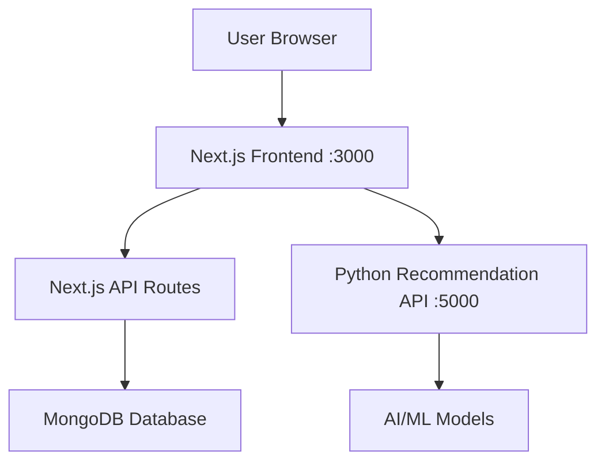

# AI-Powered E-Commerce Platform

A complete full-stack e-commerce platform with AI-powered product recommendations, built using modern technologies in a microservices architecture.

## 🏗️ Architecture

This monorepo contains two main services:

- **`aiecom/`** - Next.js 14 frontend and API (TypeScript, Tailwind CSS, MongoDB)
- **`recommendation-engine/`** - Python Flask microservice for AI recommendations

## 🚀 Quick Start

**TL;DR: Get everything running in 3 commands:**

```bash
git clone <your-repo-url> && cd AIEcom
npm install && cd aiecom && npm install && cd ../recommendation-engine && pip install -r requirements.txt && cd ..
npm run dev  # Starts both frontend and AI service!
```

**Then visit:**

- 🌐 **Frontend**: `http://localhost:3000`
- 🤖 **AI API**: `http://localhost:5000/health`
- 📊 **Admin Panel**: `http://localhost:3000/admin`

---

## 📋 Detailed Setup

### Prerequisites

- **Node.js 18+** (for Next.js frontend)
- **Python 3.8+** (for recommendation engine)
- **MongoDB** (local installation or MongoDB Atlas)
- **Git**

### 1. Clone and Setup

```bash
git clone <your-repo-url>
cd AIEcom
```

### 2. Install Dependencies

```bash
# Root level (installs concurrently for running both services)
npm install

# Frontend dependencies
cd aiecom
npm install

# Python dependencies
cd ../recommendation-engine
pip install -r requirements.txt
```

### 3. Start Both Services (Single Command!)

```bash
# From root directory - starts both Next.js and Python services
npm run dev
```

This will start:

- ✅ Next.js frontend on `http://localhost:3000`
- ✅ Python recommendation API on `http://localhost:5000`

**Alternative: Start services individually**

```bash
# Terminal 1: Next.js
npm run dev:frontend

# Terminal 2: Python API  
npm run dev:api
```

### 4. Setup Database & Seed Data

#### Option A: Local MongoDB

```bash
mongod  # Start MongoDB service
```

#### Option B: MongoDB Atlas

1. Create account at [MongoDB Atlas](https://www.mongodb.com/atlas)
2. Create cluster and get connection string  
3. Update `MONGODB_URI` in `aiecom/.env.local`

#### Seed with Sample Products

```bash
# Option 1: API endpoint (easiest)
curl -X POST http://localhost:3000/api/seed

# Option 2: Script  
npm run seed

# Option 3: Admin panel
# Visit http://localhost:3000/admin
```

## 📁 Project Structure

```
AIEcom/
├── 📂 aiecom/                     # Next.js E-commerce Frontend & API
│   ├── 📂 src/
│   │   ├── 📂 app/
│   │   │   ├── 📂 api/products/   # Product CRUD API
│   │   │   ├── 📂 admin/          # Admin panel
│   │   │   ├── 📂 products/[id]/  # Product detail pages
│   │   │   ├── layout.tsx         # Root layout
│   │   │   └── page.tsx           # Home page
│   │   ├── 📂 components/
│   │   │   └── ProductCard.tsx    # Product card component
│   │   ├── 📂 lib/
│   │   │   └── mongodb.ts         # Database connection
│   │   ├── 📂 models/
│   │   │   └── Product.ts         # MongoDB schemas
│   │   └── 📂 types/
│   │       └── mongoose.d.ts      # Type definitions
│   ├── 📂 scripts/
│   │   └── seed.ts                # Database seeding
│   ├── package.json
│   ├── README.md
│   └── .env.local                 # Environment variables
│
├── 📂 recommendation-engine/      # Python AI Microservice
│   ├── app.py                     # Flask recommendation API
│   ├── requirements.txt           # Python dependencies
│   ├── test_api.py               # API testing script
│   ├── start.sh                  # Unix start script
│   ├── start.bat                 # Windows start script
│   ├── Dockerfile                # Docker configuration
│   └── README.md                 # Service documentation
│
├── docker-compose.yml            # Multi-service orchestration
├── .gitignore                    # Comprehensive gitignore
└── README.md                     # This file
```

## 🔗 Services Communication



## 📚 API Documentation

### Next.js API (Port 3000)

**Products API:**

- `GET /api/products` - List all products
- `POST /api/products` - Create product
- `GET /api/products/[id]` - Get single product
- `PUT /api/products/[id]` - Update product
- `DELETE /api/products/[id]` - Delete product

### Python Recommendation API (Port 5000)

**Recommendations API:**

- `GET /health` - Health check
- `POST /recommendations` - Get AI recommendations

**Example Request:**

```json
{
  "userId": "user123",
  "purchaseHistory": ["product_id_1", "product_id_2"],
  "numRecommendations": 5
}
```

## 🛠️ Development Commands

### Root Level (Recommended)

```bash
npm run dev              # 🚀 Start both frontend + AI API
npm run dev:frontend     # Start only Next.js frontend
npm run dev:api          # Start only Python recommendation API
npm run seed             # Seed database with sample products
npm run test             # Run all tests
npm run docker:up        # Start with Docker Compose
```

### Frontend Only (aiecom/)

```bash
npm run dev        # Start development server
npm run build      # Build for production
npm run start      # Start production server
npm run lint       # Run ESLint
```

### Recommendation Engine Only (recommendation-engine/)

```bash
python app.py           # Start Flask server
python test_api.py      # Test API endpoints
```

### Docker (Entire Stack)

```bash
docker-compose up      # Start all services
docker-compose down    # Stop all services
docker-compose build   # Rebuild images
```

## 🚢 Deployment Options

### Option 1: Traditional Deployment

- **Frontend**: Deploy to Vercel, Netlify, or AWS Amplify
- **API**: Deploy to Railway, Render, or AWS EC2
- **Recommendation Engine**: Deploy to Heroku, AWS Lambda, or Google Cloud Run
- **Database**: MongoDB Atlas

### Option 2: Docker Deployment

```bash
docker-compose up -d    # Run entire stack in containers
```

### Option 3: Kubernetes

- Use the provided Docker images for K8s deployment
- Configure services, ingress, and persistent volumes

## 🧪 Testing

### Frontend Testing

```bash
cd aiecom
npm test               # Run Jest tests (when implemented)
npm run test:e2e       # Run Playwright tests (when implemented)
```

### API Testing

```bash
cd recommendation-engine
python test_api.py     # Test recommendation API endpoints
```

## 🔧 Environment Variables

### Frontend (.env.local)

```env
MONGODB_URI=mongodb://localhost:27017/aiecom
NEXTAUTH_SECRET=your-secret-key
NEXTAUTH_URL=http://localhost:3000
RECOMMENDATION_API_URL=http://localhost:5000
```

### Recommendation Engine

```env
FLASK_ENV=production
FLASK_APP=app.py
```

## 🎯 Roadmap

### Phase 1: Core E-commerce ✅

- [x] Product catalog
- [x] Product CRUD operations
- [x] Admin panel
- [x] MongoDB integration
- [x] Basic recommendation API
- [ ] User authentication
- [ ] Shopping cart
- [ ] Checkout process

### Phase 2: AI/ML Enhancement

- [ ] Advanced recommendation algorithms
- [ ] User behavior tracking
- [ ] Real-time personalization
- [ ] A/B testing framework
- [ ] Analytics dashboard

### Phase 3: Production Features

- [ ] Payment integration (Stripe)
- [ ] Order management
- [ ] Email notifications
- [ ] Search and filtering
- [ ] Reviews and ratings
- [ ] Inventory management

## 🤝 Contributing

1. Fork the repository
2. Create feature branch (`git checkout -b feature/amazing-feature`)
3. Commit changes (`git commit -m 'Add amazing feature'`)
4. Push to branch (`git push origin feature/amazing-feature`)
5. Open Pull Request

## 📄 License

This project is for educational purposes.

## 🆘 Support

- **Frontend Issues**: Check `aiecom/README.md`
- **Recommendation Engine**: Check `recommendation-engine/README.md`
- **General Issues**: Open GitHub issue

## 🔗 Links

- [Next.js Documentation](https://nextjs.org/docs)
- [Flask Documentation](https://flask.palletsprojects.com/)
- [MongoDB Documentation](https://docs.mongodb.com/)
- [Docker Documentation](https://docs.docker.com/)
